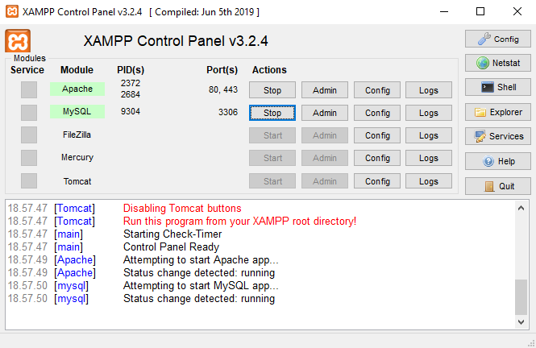
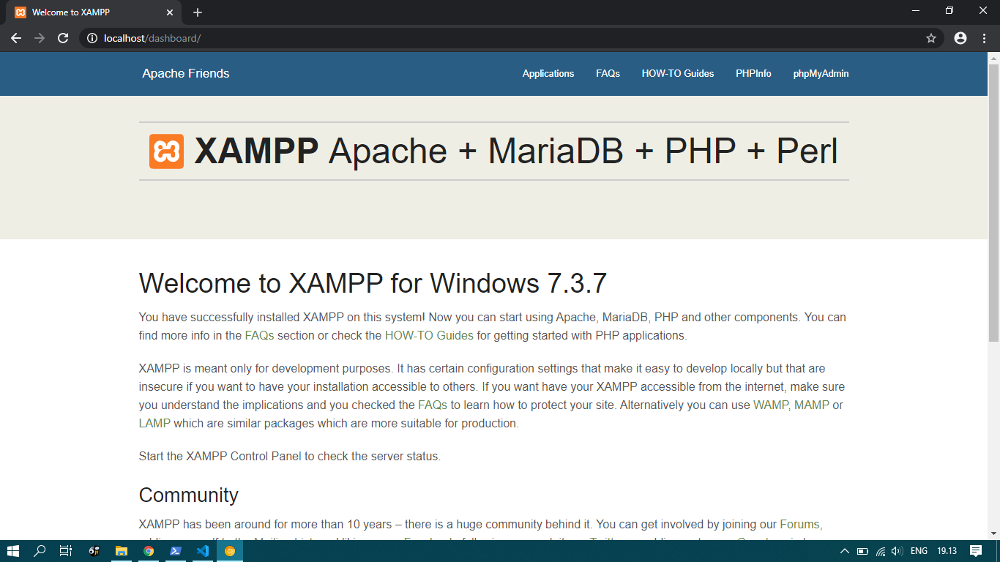
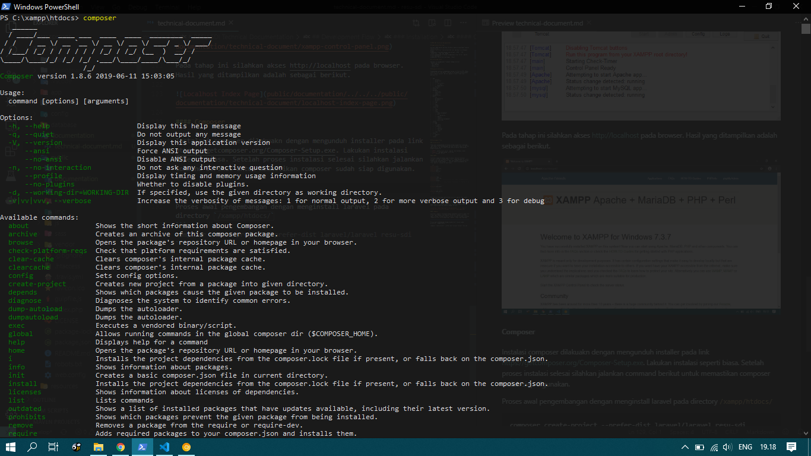
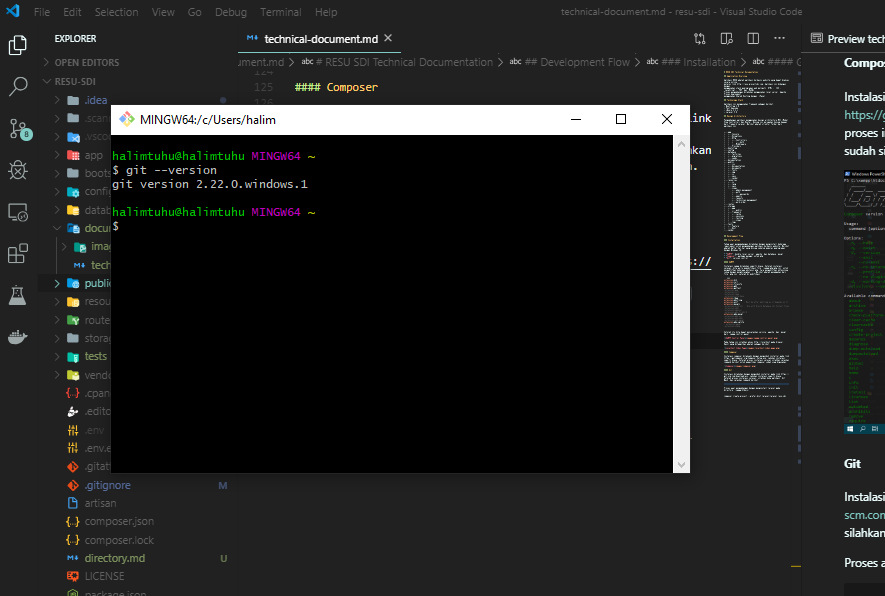
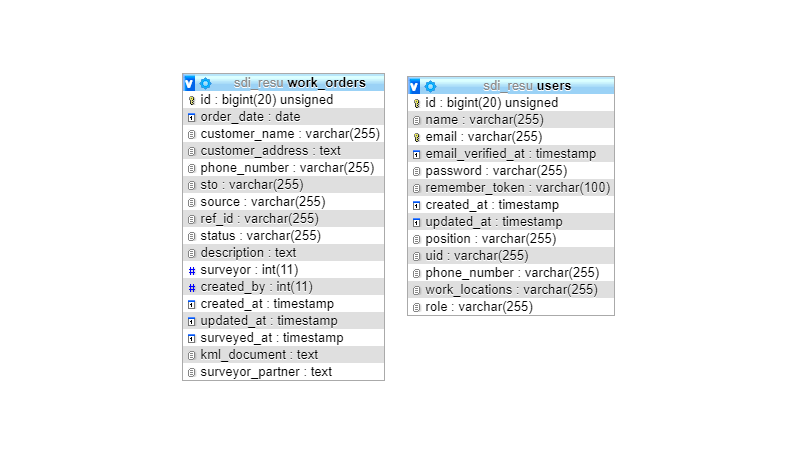

# RESU SDI Technical Documentation

## Application Overview

Aplikasi RESU adalah aplikasi berbasis website yang dapat diakses secara online
melalui link http://resu.projectsdi.com. Aplikasi ini dibangun dengan
menggunakan stack pemrograman web meliputi `HTML`, `CSS`, `JavaScript`, `PHP` dan `MySQL`.
Proses pengembangan dilakukan menggunakan local server `Apache`. Proses deployment
menggunakan Shared Hosting dengan `cPanel`.

## Technology Stack

Aplikasi ini menggunakan framewok sebagai berikut.
+ Bootstrap 4.0
+ Font Awesome
+ jQuery 3.2.1
+ Laravel 5.8

## Design Architecture

Pengembangan aplikasi menggunakan design architecture MVC (Model View Controller) dan Router. Konsep ini merupakan konsep bawaan dari framwork Laravel. Berikut adalah struktur folder dari aplikasi ini.

```
+---app
|   +---Console
|   +---Exceptions
|   +---Http
|   |   +---Controllers
|   |   |   \---Auth
|   |   \---Middleware
|   \---Providers
+---bootstrap
+---config
+---database
|   +---factories
|   +---migrations
|   \---seeds
+---documentation
+---public
|   +---css
|   +---documentation
|   +---documents
|   +---fonts
|   +---img
|   +---js
|   +---sass
|   \---vendor
+---resources
|   +---js
|   +---lang
|   +---sass
|   \---views
|       +---admin-management
|       +---auth
|       |   \---passwords
|       +---emails
|       +---layouts
|       +---technician-management
|       \---work-order
+---routes
+---storage
|   +---app
|   |   \---public
|   +---framework
|   |   +---cache
|   |   +---sessions
|   |   +---testing
|   |   \---views
|   \---logs
+---tests
|   +---Feature
|   \---Unit
\---vendor
```

## Development Flow

### Installation

Tahap awal pengemabangan dilakukan dengan menginstall beberapa requirement untuk pengembangan aplikasi berbasis website. Berikut adalah daftar hal-hal yang disiap sebelum memulai pemrograman dengan Windows 10.

* *XAMPP*: bundle local server `apache` dan database `mysql`
* *Composer*: package manager untuk php
* *Git*: version control

#### XAMPP

Instalasi xampp dilakukan seperti biasa. Setelah instalasi selesai, kita perlu memodifikasi file `/xampp/php/php.ini` untuk mengaktifkan beberapa ekstensi php. Cara mengaktifkan ektensinya cukup dengan menghilangkan `;`. Berikut adalah penampakan dari file `php.ini` setelah di modifikasi

```ini
extension=bz2
extension=curl
extension=fileinfo
extension=gd2
extension=gettext
;extension=gmp
;extension=intl
;extension=imap
;extension=interbase
extension=ldap
extension=mbstring
extension=exif      ; Must be after mbstring as it depends on it
extension=mysqli
;extension=oci8_12c  ; Use with Oracle Database 12c Instant Client
;extension=odbc
;extension=openssl
;extension=pdo_firebird
extension=pdo_mysql
;extension=pdo_oci
;extension=pdo_odbc
;extension=pdo_pgsql
extension=pdo_sqlite
; extension=pgsql
;extension=shmop
```

Setelah itu kita dapat menjalankan service `apache` dan `mysql` dari `xampp-control-panel`.



Pada tahap ini silahkan akses http://localhost pada browser. Hasil yang ditampilkan adalah sebagai berikut.



#### Composer

Instalasi composer dilakuakn dengan mengunduh installer pada link https://getcomposer.org/Composer-Setup.exe. Lakukan instalasi seperti biasa. Setelah proses instalasi selesai silahkan jalankan command berikut untuk memastikan composer sudah siap digunakan.



#### Git

Instalasi dilakukan dengan mengunduh installer pada link https://git-scm.com/download/win. Lakukan instalasi seperti biasa. Setelah proses instalasi selesai, silahkan buka aplikasi `Git Bash` dan jalankan command berikut.



### Start Coding

Proses awal pengembangan dengan menginstall laravel pada directory `/xampp/htdocs/`

```
composer create-project --prefer-dist laravel/laravel resu-sdi "5.8.*"
```

Setelah seluruh proses instalasi selesai silahkan masuk kedalam folder project

```
cd resu-sdi
```

Untuk menjalankan aplikasi kita dapat menjalankan command berikut pada folder project

```
php artisan serve
```

Akses aplikasi melalui link http://localhost:8000. Proses pengembangan akan terus berlanjut melaui proses ini.

#### Database Design

Database yang digunakan untuk project ini adalah *MySQL* . Kita dapat membuat database baru melalui aplikasi *phpMyAdmin* yang dapat diakses melalui http://localhost/phpmyadmin. Buat database baru dengan nama `sdi_resu`.

Berikut adalah skema database yang akan digunakan.



#### Laravel Migration

Pembuatan table pada database dilakukan dengan menggunakan [Migration](https://laravel.com/docs/5.8/migrations#introduction) pada laravel. Untuk membuat migration kita dapat menggunakan command berikut.

```
php artisan create:migration create_work_order_table
```

Command tersebut akan membuat satu file `.php` baru pada directory `/database/migrations`. Untuk membuat struktur table kita dapat membuatnya menggunakan `Schema` dan `Blueprint` dari laravel. Berikut adalah isi dari migrasi yang barusan dibuat.

```php
<?php

use Illuminate\Support\Facades\Schema;
use Illuminate\Database\Schema\Blueprint;
use Illuminate\Database\Migrations\Migration;

class CreateWorkOrdersTable extends Migration
{
    /**
     * Run the migrations.
     *
     * @return void
     */
    public function up()
    {
        Schema::create('work_orders', function (Blueprint $table) {
            $table->bigIncrements('id');
            $table->date('order_date');
            $table->string('customer_name');
            $table->text('customer_address');
            $table->string('phone_number');
            $table->string('sto');
            $table->string('source');
            $table->string('ref_id');
            $table->string('status')->nullable();
            $table->text('description')->nullable();
            $table->integer('surveyor')->nullable();
            $table->integer('created_by')->nullable();
            $table->timestamps();
        });
    }

    /**
     * Reverse the migrations.
     *
     * @return void
     */
    public function down()
    {
        Schema::dropIfExists('work_orders');
    }
}
```

Untuk seluruh perubahan yang akan terjadi pada table kita dapat membuat migrasi baru untuk mengupdate table yang diinginkan.

#### Route and MVC Model

Aplikasi ini menggunkan model MVC yaitu Model View Controller. Ketika user mengakes URL, server akan memeriksa apakah URL yang diminta (request) tersedia atau tidak pada directory `routes`. Jika tersedia maka server akan memanggil *Controller* sesuai dengan definisi `routes` pada file `routes/web.php`.

Controller yang dipanggil akan menjalankan sintaks programnnya dan seperti mengolah data yang disediakan oleh *Model* dan mengirim response yang dapat berupa *View*.

#### Authentication in Laravel

Proses authentikasi pada aplikasi ini menggnakan bawaan dari Laravel dengan mengecualikan fitur registrasi user. 

Login dapat dilakukan dengan mangakses url `/login`. Proses login akan ditangani oleh `app/Http/Controllers/Auth/LoginController.php`. Flow dari login adalah sebagai berikut 
1. dimulai dari user menginputkan credential. 
2. sistem melakukan validasi input dari user.
3. sistem memeriksa apakah input user sesuai dengan yang ada pada databese melalui *Model* `app/User.php`.
4. jika data tersedia maka login sukses
5. jika data tidak tersedia maka login gagal

```
user login > validasi input > pengecekan user pada database > login sukses
```

Setelah login selesai, user akan diarahkan ke halaman `/` atau dashboard

#### View Templates

Aplikasi ini memiliki template yang terdapat pada `resources/views/layouts/app.blade.php`. File ini adalah template utama yang berisi *Navbar* dan *Sidebar*. Menu yang ada pada *Sidebar* akan di limit berdasarkan user yang login di sini. Berikut adalah potongan kode dari *Sidebar* dan cara membatasi akses dari user yang login.

```html
...
<div class="sidebar" data-image="{{ asset('img/background-1.jpg') }}" data-color="black">
    <!--
        Tip 1: You can change the color of the sidebar using: data-color="purple | blue | green | orange | red"

        Tip 2: you can also add an image using data-image tag
    -->
    <div class="sidebar-wrapper">
        <div class="logo">
            <a href="{{ route('home') }}" class="simple-text">
                {{ config('app.name') }}
            </a>
        </div>
        <ul class="nav">
            <li class="nav-item{{ Route::is('home') ? ' active' : '' }}">
                <a class="nav-link" href="{{ route('home') }}">
                    <i class="nc-icon nc-app"></i>
                    <p>Dashboard</p>
                </a>
            </li>
            @if(auth()->user()->isAdmin())
                <li class="nav-item{{ Route::is('work-order.create') ? ' active' : '' }}">
                    <a class="nav-link" href="{{ route('work-order.create') }}">
                        <i class="nc-icon nc-paper-2"></i>
                        <p>Create Workorder</p>
                    </a>
                </li>
            @endif
            <li class="nav-item{{ Route::is('work-order.index') ? ' active' : '' }}">
                <a class="nav-link" href="{{ route('work-order.index') }}">
                    <i class="nc-icon nc-bullet-list-67"></i>
                    <p>Review Workorders</p>
                </a>
            </li>
            ...
        </ul>
    </div>
</div>
...
```

File ini hanya manyajikan template dan tempat untuk konten-konten yang ada pada sistem ini.

```html
...
<div class="sidebar" data-image="{{ asset('img/background-1.jpg') }}" data-color="black">
    ...
</div>

<div class="main-panel">
    <!-- Navbar -->
    <nav class="navbar navbar-expand-lg " color-on-scroll="500">
        ...
    </nav>
    <!-- End Navbar -->
    <div class="content">
        <div class="container-fluid">
            <div class="section">
                @yield('contents')
            </div>
        </div>
    </div>
    <!-- Footer -->
    <footer class="footer">
        <div class="container">
            <nav>
                <p class="copyright text-center">
                    ©
                    <script>
                        document.write(new Date().getFullYear())
                    </script>
                    <a href="{{ route('home') }}">{{ config('app.name') }}</a>, made with love for a better world
                </p>
            </nav>
        </div>
    </footer>
</div>
...
```

#### Dashboard

Merupakan fitur yang menyajikan halaman awal dari aplikasi ini. Data yang disajikan pada halaman ini adalah sebagai berikut.

+ Pesan sambutan
+ Jumlah WO berdasarkan User
+ Jumlah Teknisi yang terdaftar

Berikut adalah file-file yang berhubungan dengan fitur *Dashboard*.

+ `/app/Http/Controllers/HomeController.php` method `index`
  + `/app/WorkOrder.php` untuk mengambil data Work Order
  + `/app/User.php` untuk mengambil data User dengan role Technician
+ `/resources/views/home.blade.php` untuk mengatur tampilan dari *Dashboard*

Berikut adalah alur dari flow *Dashboard*
1. User mengakses halaman *Dashboard* melalui link `/home` atau `/`
2. Pada file `/routes/web.php`, link `/home` dan `/` diarahakan ke controller `/app/Http/Controllers/HomeController.php` pada method `index()`
3. Controller akan mengambil data WO yang belum dikerjakan dengan menggunakan model `/app/WorkOrder.php`
4. Controller akan mengambil data Teknisi yang terdaftar dengan menggunakan model `/app/User.php`
5. Controller akan memberi balikan berupa view `/resources/views/home.blade.php`
6. View akan menyajikan tampilan dashboard dengan data yang sudah disediakan dari controller

#### Create Work Order

Merupakan fitur yang digunakan oleh *Admin* untuk membuat Workorder baru.

Berikut adalah file-file yang berhubungan dengan fitur *Create Work Order*.

+ `/app/Http/Controllers/WorkOrderController.php` method `create` untuk menghandle request dan menyajikan *view*
+ `/resources/views/work-order/create.blade.php` view yang disajikan berbentuk form isian untuk membuat WO
+ `/app/Http/Controllers/WorkOrderController.php` method `store` untuk menghandle request dari form
  + `/app/WorkOrder.php`

Berikut adalah alur dari flow *Create Work Order*
1. User mengakses halaman *Create Work Order* melalui link `/work-order/create`
2. Pada file `/routes/web.php`, link tersebut akan diarahkan ke controller `/app/Http/Controllers/WorkOrderController.php` pada method `create()`
3. Controller akan memberi balikan berupa view `/resources/views/work-order/create.blade.php`
4. View akan menyajikan form untuk membuat *Work Order* baru.
5. Form pada view akan membuat `POST` request pada link `/work-order`
6. Pada file `/routes/web.php`, request/link tersebut akan diarahkan ke controller `/app/Http/Controllers/WorkOrderController.php` pada method `store(Request $request)`
7. Controller akan melakukan validasi dari request atau hasil input user
8. Controller akan menyimpan data WO baru ke database
9. Controller akan memberikan balikan ke link `/work-order` atau ke fitur *Review Workorder*

#### Review Workorder

Merupakan fitur yang menyajikan data Workorder yang akan belum dikerjakan oleh Teknisi. Data yang tampil berdasarkan User login.

Berikut adalah file-file yang berhubungan dengan fitur *Review Workorder*.

+ `/app/Http/Controllers/WorkOrderController.php` method `index` 
  + `/app/WorkOrder.php`
  + `/config/resu.php`
+ `/resources/views/work-order/index.blade.php` view yang disajikan berbentuk tabel yang berisi data WO

Berikut adalah alur dari flow *Review Workorder*
1. User mengakses halaman *Review Workorder* melalui link `/work-order`
2. Pada file `/routes/web.php`, link tersebut akan diarahkan ke controller `/app/Http/Controllers/WorkOrderController.php` pada method `index()`
3. Controller akan melakukan perkejaan sebagai berikut.
   1. Get data Workorder yang belum dikerjakan dari model `/app/WorkOrder.php`
   2. Mengurutkan data Workorder berdasarkan skala prioritas yang telah di set pada `/config/resu.php`
   3. Jika user adalah teknisi, get data Workorder berdasarkan lokasi kerja teknisi
   4. Filter data workrder berdasarkan filter dari halaman
   5. Menyajikan view data WO
4. View menyajikan data WO dalam bentuk tabel
5. View menyajikan tombol aksi berupa `show` `edit` `delete`
   1. Fitur `show` digunakan untuk melihat detail dari Workorder. Berikut adalah alur dari fitur `show`.
      1. User mengakses tombol `show` dan akan diarahkan ke link `/work-order/{id}`
      2. Pada file `/routes/web.php`, link tersebut akan diarahkan ke controller `/app/Http/Controllers/WorkOrderController.php` pada method `show()`
      3. Controller akan menyajikan view yang berisi detail dari Workorder
   2. Fitur `edit` digunakan untuk memperbaharui data Workorder. Berikut adalah alur dari fitur `edit`
      1. User mengakses tombol `edit` dan akan diarahkan ke link `/work-order/{id}/edit`
      2. Pada file `/routes/web.php`, link tersebut akan diarahkan ke controller `/app/Http/Controllers/WorkOrderController.php` pada method `edit()`
      3. Controller akan menyajikan view `/resources/views/work-order/edit.blade.php`
      4. View menyajikan form untuk memperbaharui data Workorder
      5. Ketika form disubmit maka form akan mengirim `PUT` request ke link `/work-order/{id}`
      6. pada file `/routes/web.php`, request / link tersebut akan diarahkan ke controller `/app/Http/Controllers/WorkOrderController.php` pada method `update()`
      7. Controller akan melakukan pekerjaan berikut.
         1. Melakukan validasi dari input user
         2. Memperbaharui data Workorder yang ada pada database
         3. Memberikan balikan dengan mengirim user ke link `/work-order`
   3. Fitru `delete` digunakan untuk menghapus data Workorder. Berikut adalah alur dari fitur `delete`
      1. User mengakses tombol `delete` dan akan mengirim `DELETE` request ke link `/work-order/{id}`
      2. Pada file `/routes/web.php`, link tersebut akan diarahkan ke controller `/app/Http/Controllers/WorkOrderController.php` pada method `delete()`
      3. Controller akan menghapus data Workorder dari database dan mengarahkan user kembali ke link `/work-order`

#### Closed Workorder

Merupakan fitur khusus untuk Admin yang akan menyajikan data Workorder yang sudah dikerjakan.

Secara keseluruhan fitur ini sama dengan fitur *Reveiw Workorder* hanya saja link yang diarahkan ke `/work-orde/closed` dan controller yang digunakan adalah `/app/Http/Controllers/WorkOrderController.php` pada method `closed()`.