# RESU - SDI Projects

This is the repo for RESU from SDI.

## Initial Requirements

1. XAMPP with server requirement:
    - PHP >= 7.1.3
    - BCMath PHP Extension
    - Ctype PHP Extension
    - JSON PHP Extension
    - Mbstring PHP Extension
    - OpenSSL PHP Extension
    - PDO PHP Extension
    - Tokenizer PHP Extension
    - XML PHP Extension
2. Git
3. Composer
4. Text Editor (Notpad++, Sublime, Atom, VSCode, etc)

## Installation Procedure

Follow this guide for installation on windows environment using XAMPP. Use `PowerShell` to run command.
1. Clone this repository `git clone https://github.com/halimtuhu/resu-sdi.git` on `htdocs` folder
2. Make sure repo is in `master` branch or run `git checkout master`
3. Install all dependency packages by run `composer install`
4. Copy .env.example to .env `cp .env.example .env`
5. Create new database with name `resu_sdi`
6. Modify `.env` configuration to match with local database
    ```$xslt
    APP_NAME=RESU
    APP_ENV=local
    APP_KEY=base64:ZYl+f7xLgOf5Xrr96bo6c/ClLqmRqmcQaXeak+KdZVg=
    APP_DEBUG=true
    APP_URL=http://localhost:8000
    
    LOG_CHANNEL=stack
    
    DB_CONNECTION=mysql
    DB_HOST=127.0.0.1
    DB_PORT=3306
    DB_DATABASE=resu_sdi
    DB_USERNAME=root
    DB_PASSWORD=
    ```
7. Run `php artisan key:generate`
8. Run `php artisan migrate --seed`
9. Test application by running `php artisan serve` and go to http://localhost:8000 or http://127.0.0.1:8000

From here, the application must run smoothly on your local machine.

## Deployment

This is guide to deploy the application to server using cPanel. We will using Git Version Control feature so make sure there is Git Version Control feature on your cPanel.

> Using Git Version Control feature on cPanel will help a lot on the deployment or event on the development process. As we can make an update more easily by doing the pull and deploy action.

### Clone, Pull and Deploy

1. Go to cPanel
2. Click `Git Version Control` on `Files` section
   
   

3. Click `Create` button on right side on your screen to create new repository on cPanel

    

4. Fill the form like the image below. Make sure to the `Repository Path` is directed to `public_html`. Then click `Create`.

    

5. Wait the proccess finish.
6. Open you repository by click `Manage` button
   
   

7. From here you have been succesfuly clone your repository to cPanel

    

8. You can pull and deploy your repository on `Pull or Deploy` tab.
9. Click `Update from Remote` to make sure your repository is up to date with the latest change on `master` branch
10. After finish updating or pulling, click `Deploy HEAD Commit` to deploy your repository to cPanel so it can be access from your domain.
    
    

11. Once you have done deploying, you will see the detail of latest deployment on right side of the panel

### Change Project Permission

1. Go to cPanel Dashboard and click `Filemanager`
2. Make sure you are in `public_html`. You will see your repository folder with permission `0700`
   
   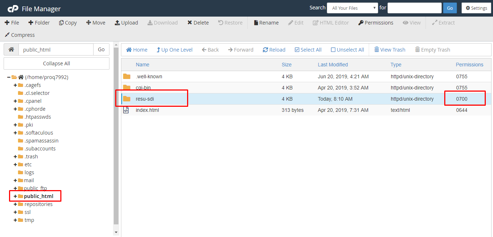

3. Change the permission to `0755` by clicking on the permission column
   
   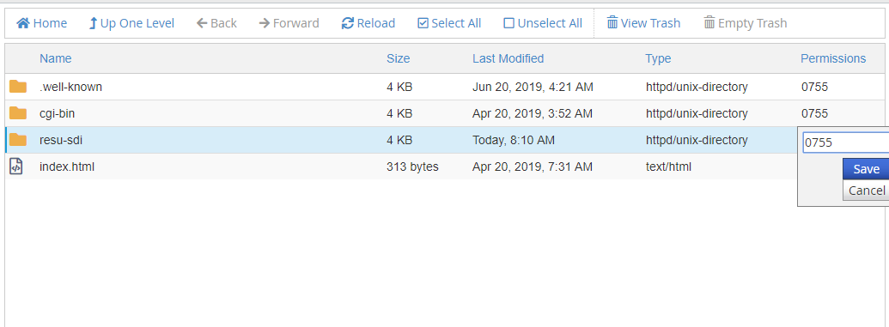

4. This will allow web browser to access this folder and execute the application

### Prepare Database

1. Go to cPanel Dashboard and click MySQL Database
2. Create new Database with name `sdi_resu`

    

3. Add new user with name `sdi_resu` and password `rahasia123`
   
    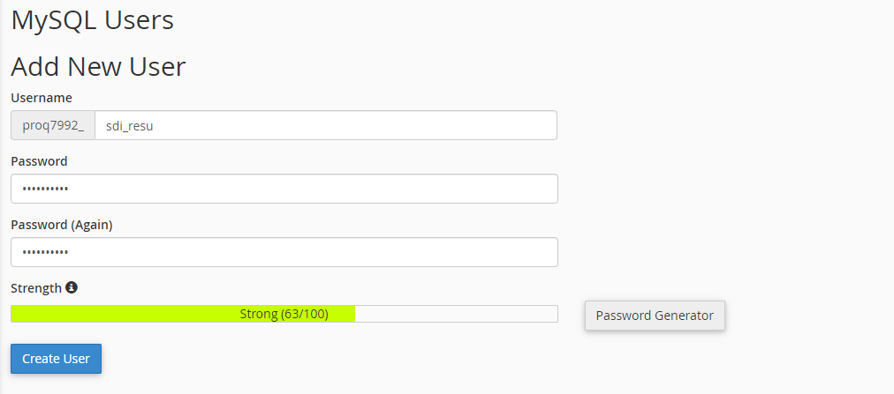

4. Add user `sdi_resu` to database `sdi_resu` ang grant `ALL PRIVILEGES`

    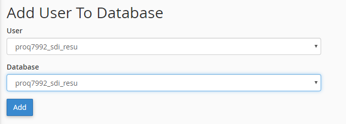

5. Open phpMyAdmin by go to cPanel Dashboard and click phpMyAdmin

    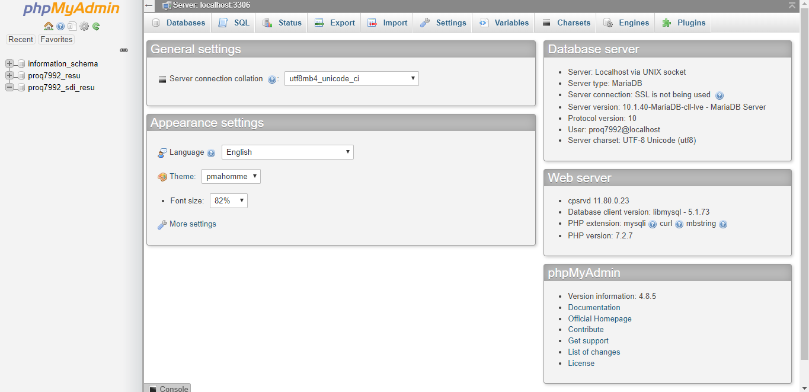

6. Select database with name `proq7992_sdi_resu`

    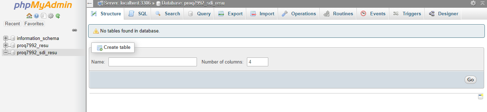

7. Open Import tab

    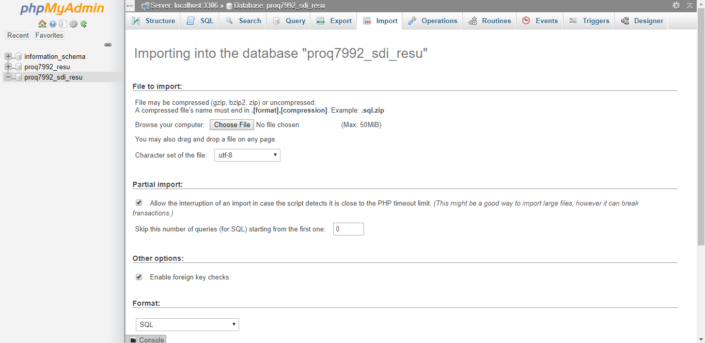

8. Download [this file](resu-sdi.sql) and import it to phpMyAdmin

    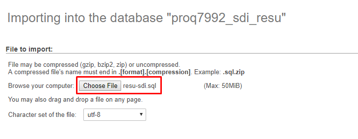

9.  Click `Go`
    
    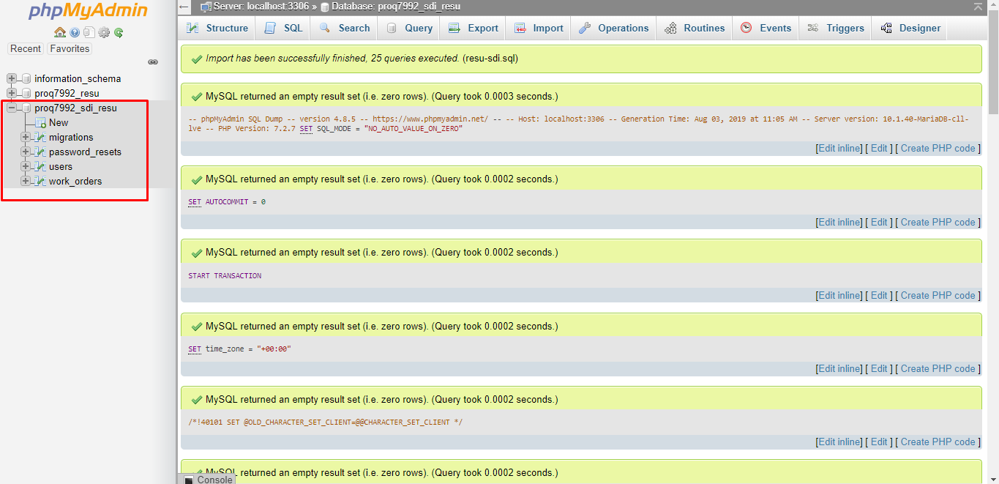

### Set Up Project Environment

1. Go to cPanel Dashboard and click `Filemanager`
2. Open `resu-sdi` folder
3. Copy `.env.example` with name `.env`
4. Edit `.env` file to match with server envinroment.

    ```
    DB_CONNECTION=mysql
    DB_HOST=127.0.0.1
    DB_PORT=3306
    DB_DATABASE=proq7992_sdi_resu
    DB_USERNAME=proq7992_sdi_resu
    DB_PASSWORD=rahasia123
    ```
5. Save file

### Make Subdomain

1. Go to cPanel Dashboard and click `Subdomains` in Domain section
2. Click `Create New Domain`
   
   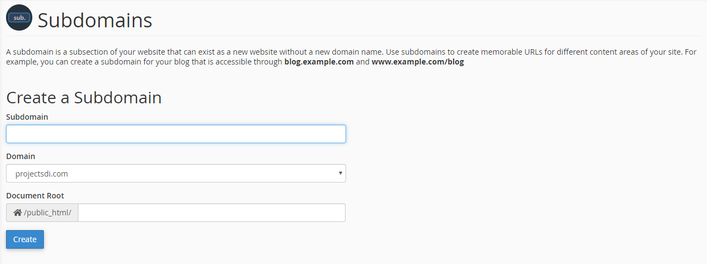

3. Fill the form to create a new subdomain. Make sure to fill the Document Root to `public` folder on your application.
   
   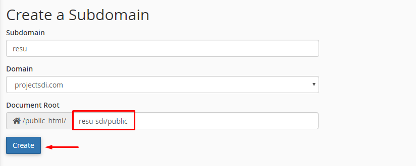

4. Click `Create` and wait the process until you see a success message.
5. From here you can access your project with your subdomain. http://resu.projectsdi.com
6. Default Admin Credential
   
   ```
   email : admin@admin.com
   password : Admin123!
   ```